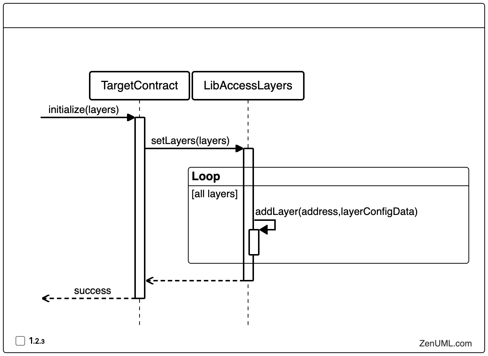
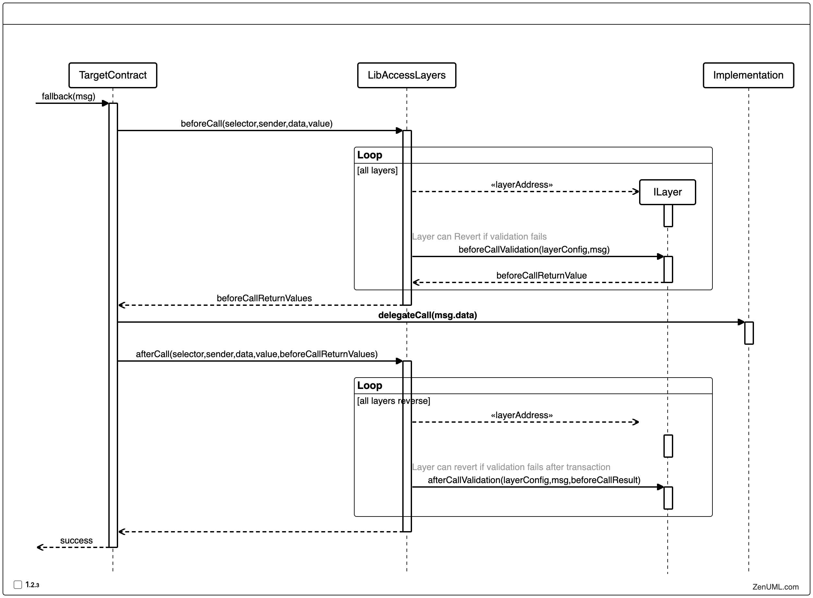

# Smart contract layers

This is proof of concept repository intended to demonstrate the ability of layered approach in smart contract development to encapsulate security tasks to the layers that act as middleware.

## Concept

Provide a wrapper(s) to the contract only entry point (i.e. `fallback()`) access management.

Make each wrapper eligible to receive complete information data (`msg.*` fields) via standardized API. Rely on wrappers to revert transactions per their internal logic conditions.

### Layer contracts

Layer contracts are separate middlewares that are agnostic from a particular protected contract and can accept a configuration from the caller as well as message fields and analyze them. If layer is failing to validate inputs it must revert.

Such architectural decision allows for each layer to be managed by independent security provider. Such can be upgraded and managed orthogonally and accommodate large amount of secured contracts.

#### Initialization

#### Operation

## Implementation

In this proof of concept a simple rate limiter is implemented which limits number of transactions a method can be called during one block, reducing ability to drain contract funds.

[LayeredProxy](https://github.com/peersky/smart-contract-layers/blob/main/src/LayeredProxy.sol) contract is modified version of TransparentUpgradeableProxy which adds a layered pattern that is defined by [LibAccessLayer](https://github.com/peersky/smart-contract-layers/blob/main/src/LibAccessLayers.sol) in form of a [modifier](https://github.com/peersky/smart-contract-layers/blob/main/src/AccessLayers.sol)

Contract protecting the implementation only needs to implement a [ILayer](https://github.com/peersky/smart-contract-layers/blob/main/src/ILayer.sol) in order to be connected

Drainer contract calls victim number of times defined by Drainer function input.

In the particular implementation rate is limited to 10 transactions per block and can be tested by `pnpm test`
